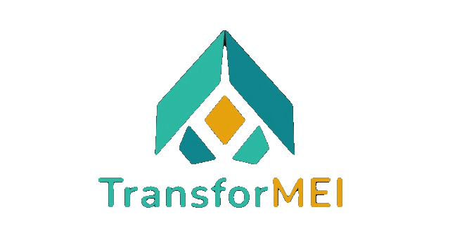

 

<h2 align="center">🎯 Objetivo 🎯</h2>

Transformei é uma plataforma que acaba com o acúmulo de funções do microempreendedor individual com um sistema de gestão integrado, que aborda o controle financeiro, controle de vendas com geração de gráficos e estatísticas importantes e controle do estoque de todos os produtos cadastrado.

##

<h2 align="center">💻 Nossa Plataforma 💻</h2>

 

<h2 align="center">📲 Cardápio Digital 📲</h2>

Criamos um atendimento rápido e eficiente via QR Code com o objetivo de diminuir as enormes filas e presando a qualidade no atendimento,  onde o cliente terá acesso á um cardápio digital com todos os produtos vendidos pelo estabelecimento. 

##

<h2 align="center">✔ Tecnologias Utilizadas ✔</h2>

    
    
    
    
    
    
    
    
    
 

 ##

